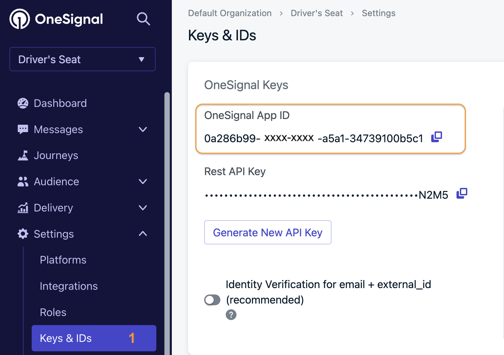
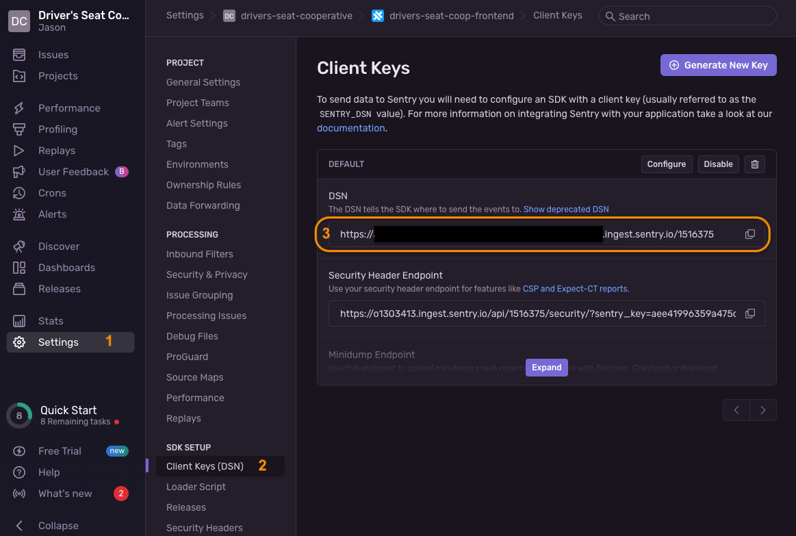
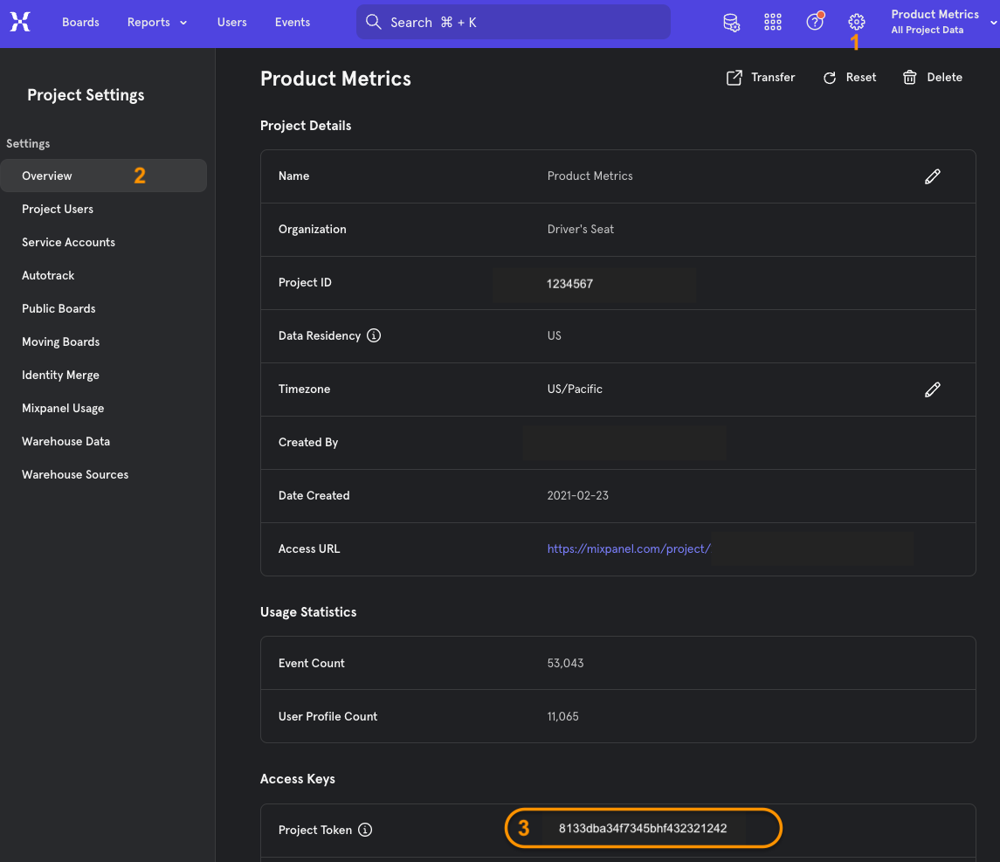

# Getting Started

This document will guide you through adopting this open-source repository and configuring the mobile app for your development team/environment.

## Prerequisites

* A functioning API application (see [GITHUB REPO HERE])
* Accounts with the following services
  * Argyle
  * MixPanel
  * OneSignal
  * Sentry
* A Transistorsoft Background Geolocation License key

* [Homebrew](https://brew.sh/) Installed
* [NodeJS](https://nodejs.org/en/download/package-manager#alternatives-2) Installed

  ```shell
  brew install node
  ```

* Angular CLI Installed

  ```shell
  sudo npm install -g @angular/cli
  ```

* Ionic installed

    ```shell
    sudo npm install -g @ionic/cli 
    ```

* Create a fork of this repository and clone it to your local machine.
* From the root of your local repo, execute the following to download packages.

    ```shell
    npm install
    ```

    Sometimes issues trouble with the sentry plugins.   Uninstalling and reinstalling helps.

    ```shell
    npm uninstall @sentry/angular @sentry/capacitor
    npm install @sentry/angular @sentry/capacitor
    npm install
    ```

## Identify your App and Organiation

|                   | Example Value                     | Description  |
|---                |---                                |---           |
| App Name          | `Driver's Seat`                   | The friendly name of the app displayed throughout the app to users |
| Organization Name | `Driver's Seat Cooperative, LCA`  | Displayed to users on the copyright notice of the splash screen |
| App ID            | `co.driversseat.app`              | Sets the bundle identifier (ios) and package identifier (android).  Ideally you should set this up early to confirm it's available.  It's difficult to change later. |

* Update **[capacitor.config.ts](/capacitor.config.ts)** with your settings similar to below

  ```ts
  import { CapacitorConfig } from '@capacitor/cli';

  const config: CapacitorConfig = {
    "appId": "[[YOUR APP ID]]",                   <== REPLACE THE VALUE HERE
    "appName": "[[YOUR APP NAME]]",               <== REPLACE THE VALUE HERE
    ...
  }

  export default config;
  ```

* Update **[environmentBase.ts](/src/environments/environmentBase.ts)** your settings similar to below

  ```ts
  // These are base settings that will apply to all of your environments.
  // Any conflicting values set in a specific environment will override values here.
  export const environmentBase = {
    appDisplayName: "[[YOUR APP NAME]]",         <== REPLACE THE VALUE HERE
    orgDisplayName: "[[YOUR ORG NAME]]",         <== REPLACE THE VALUE HERE
  }
  ```  

## Customize Icon, Logo, and Splashscreen Images

The following images should be customized for your product.  Placeholder files in the following locations should be replaced.

|File path                              | Image Size    | Description  |
|---                                    |---            |---           |
|`/resources/icon-only.png`<br/>`/resources/icon-foreground.png`<br/>`/resources/icon-background.png` | 1024 x 1024   | The basis for the native app icon |
|`/resources/splash.png`<br/>`/resources/splash-dark.png`<br/>`/src/assets/imgs/splash.png`           | 2732 x 2732   | The basis for the native app splash screen |
|`/src/assets/imgs/logo_small.png`                                                                    | 360 x 360     | The ionic app logo.   Mainly appears in login, password reset, and onboarding |

## Environments and Configurations

There are multiple configurations available that should be customized.

* **local** - Use for development work and local testing.  It is the default.
  * Configuration File: [environment.local.ts](../../src/environments/environment.local.ts)
  * API Endpoint:  http://localhost:4000
  * All external services disabled
  * Suitable for local testing on iOS emulators
  <br/>
* **local-android** - Use for local development and testing on Android emulators which require a different API endpoint address for localhost.
  * Configuration File: [environment.local-android.ts](../../src/environments/environment.local-android.ts)
  * API Endpoint: http://10.0.2.2:4000  (which is localhost)
  * All external services disabled
  * Suitable for local testing on Android emulators
  <br/>
* **local-prod** - Useful for debugging production problems in a development environment or validating new features against the current production API.
  * Configuration File: [environment.local-prod.ts](../../src/environments/environment.local-prod.ts)
  * API Endpoint needs to be updated to point to your production API
  * All external services enabled
  * Suitable for local testing on iOS and Android emulators.
  <br/>

* **test** - A pre-production test environment.
  * Configuration File: [environment.test.ts](../../src/environments/environment.test.ts)
  * API Endpoint needs to be updated to point to your test API
  * All external services are enabled, _but they should point to sandbox or test instances_
  <br/>

* **prod** - Your production configuration used when building the release copy of the app
  * Configuration File: [environment.prod.ts](../../src/environments/environment.prod.ts)
  * API Endpoint needs to be updated to point to your production API
  * All external services enabled

## Configure API Endpoint
  * Update your environment files with your settings similar to below
    ```ts
    import BackgroundGeolocation from "@transistorsoft/capacitor-background-geolocation";
    import { LogLevel } from "src/app/services/logging/LogLevel";

    export const environment = {
      ...
      apiEndpoint: "[[YOUR API ENDPOINT]]",
      ...
    }
    ```  


## Configure Argyle

* Update your environment files with your settings similar to below.  Do not remove the `argyle` section or any of its keys.  If a value is not available, set it to `null`.
* **For non-production environments, it is recommended that you use the [Argyle Sandbox environment](https://argyle.com/docs/overview/sandbox-testing) so as to not mix test data with production data and/or incurr unnecessary services charges.**
    ```ts
    import BackgroundGeolocation from "@transistorsoft/capacitor-background-geolocation";
    import { LogLevel } from "src/app/services/logging/LogLevel";

    export const environment = {
      ...
      argyle: {
        ...
        key: "[[YOUR ARGYLE KEY or null]]",
        customizationId: "[[OPTIONAL ARGYLE CUSTOMIZATION ID OR null]]"
      },
      ...
    }
    ```  

## Configure OneSignal (Push Notifications)

* Obtain your OneSignal App ID
  

* Update with settings similar to below.  Do not remove the `OneSignal` section or any of its keys.  Set values to `null` if not available.
* **For non-production environments, it is recommended that you set up a secondary project so as to not mix test data with production data and/or incurr unnecessary services charges.**

    ```ts
    export const environment = {
      ...
      oneSignal: {
        appId: "[[YOUR ONESIGNAL APP ID]]"          <== REPLACE VALUE HERE OR SET NULL
      }
      ...
    }
    ```  

## Configure Sentry (Error Reporting)

* Obtain the DSN (Ingest endpoint) for your project
  

* Update your environments with your settings similar to below.  Do not remove the `sentry` section or any of its keys.  If a value is not available, set it to `null`.

* **For test and prod environments, it is recommended that you set up a seperate projects with associated DSNs so as to get clear error reporting.**

  ```ts
  import BackgroundGeolocation from "@transistorsoft/capacitor-background-geolocation";
  import { LogLevel } from "src/app/services/logging/LogLevel";

  export const environment = {
    ...
    sentry: {
      dsn: [[YOUR SENTRY DSN OR null]]
    },
    ...
  }
  ```  

## Configure Mixpanel (Event Tracking)

* **For test and production, it is recommended that you set up seperate Mixpanel projects so as to avoid data conflicts and/or false reporting**
* Obtain the project token for your project
  

* Update your environment  with your mixpanel settings similar to below.  Do not remove the `mixPanel` section or any of its keys.  If a value is not available, set it to `null`.

  ```ts
  import BackgroundGeolocation from "@transistorsoft/capacitor-background-geolocation";
  import { LogLevel } from "src/app/services/logging/LogLevel";

  export const environment = {
    ...
    mixPanel: {
      token : [[YOUR MIXPANEL TOKEN OR null]]
    },
    ...
  }
  ```  

## Running the app locally

* Running the app on a local web server

  ```shell
  ionic serve
  ionic serve --configuration=local
  ionic serve --configuration=local --no-open                       #prevents additional browser windows from opening
  ionic serve --configuration=local-prod
  ionic serve --configuration=test
  ```

## Next Steps

* [Setting up the iOS app](./ios/README.md)
* [Setting up the Android app](./android/README.md)
