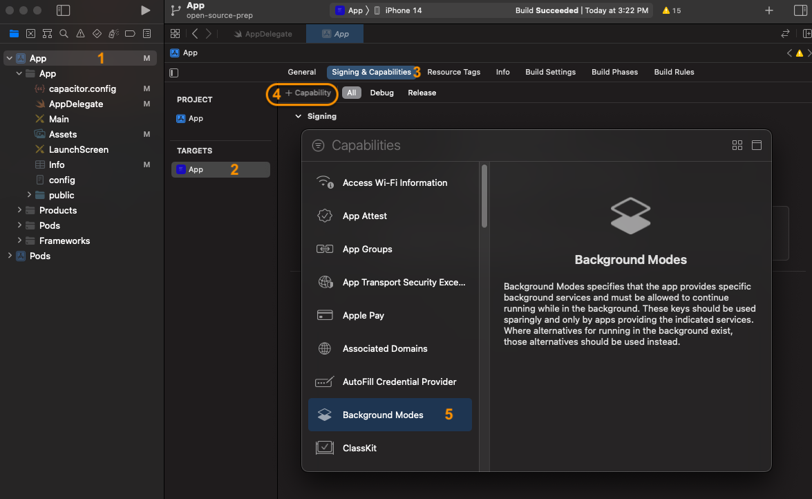

# Setting up the iOS Native App

## Prerequisites

* Apple Developer Account (w/ team)
* XCode installed
* Install coco-pods (this will take a few minutes)
```sudo gem install cocoapods```
* A functioning ionic web app that communicates with an API server
* capacitor.config.ts should have an appId and appName
* A OneSignal Account

## Generate the native app

At the root of your local repo, execute the following which will add an `ios` folder with an XCode project.

```shell
ionic cap sync
ionic cap add ios
```

Ensure that all packages (pods) are installed and up to date.

```shell
(cd ios/App && \
pod install)
```

## Generate App Image Assets
  
* From the root of your local repo, execute the following which will set up the splashscreen and app icon images based on the images that you set up for your project

  ```shell
  npx capacitor-assets generate --ios
  ```

* The following images files are capacitor default images and should be removed

  ```shell
  rm ios/App/App/Assets.xcassets/Splash.imageset/splash-2732x2732-1.png
  rm ios/App/App/Assets.xcassets/Splash.imageset/splash-2732x2732-2.png
  rm ios/App/App/Assets.xcassets/Splash.imageset/splash-2732x2732.png
  ```

## Set up your Xcode Project

* Execute the following to build the ionic app for iOS and open XCode

  ```shell
  ionic cap sync ios
  ionic cap build ios
  ```

* Make sure the app display name is correct and disable landscape display modes
  

* Then, set up the project automatically manage signing using team settings
  

## Configure Background Geolocation Plugin (Transistorsoft)

* Full Documentation: https://github.com/transistorsoft/capacitor-background-geolocation/blob/master/help/INSTALL-IOS.md

* Configure app so that it can perform tasks in the background

  First, add the "Background Modes" capability to your app (if not already there)
  

  Then, enable  Audio, Background Fetch, and Background Processing Modes
  
  <br/>

* Modify the iOS App startup code to reference and activate the geolocation plugin.  When complete, the first two functions of your App Delegate should appear similar to below.

  **[ios/App/App/AppDelegate.swift](../../../ios/App/App/AppDelegate.swift)**

  ```swift
  import UIKit
  import Capacitor
  import TSBackgroundFetch    // THIS IS NEW

  @UIApplicationMain
  class AppDelegate: UIResponder, UIApplicationDelegate {

      var window: UIWindow?

      func application(_ application: UIApplication, didFinishLaunchingWithOptions launchOptions: [UIApplication.LaunchOptionsKey: Any]?) -> Bool {
          
          // THIS IS NEW CODE IN AN EXISTING FUNCTION
          // [capacitor-background-fetch]
          // https://github.com/transistorsoft/capacitor-background-geolocation/blob/master/help/INSTALL-IOS.md
          let fetchManager = TSBackgroundFetch.sharedInstance();
          fetchManager?.didFinishLaunching();
          
          return true
      }
      
      // THIS FUNCTION IS NEW
      // [capacitor-background-fetch]
      // https://github.com/transistorsoft/capacitor-background-fetch/blob/master/help/INSTALL-IOS.md#configure-background-capabilities
      func application(_ application: UIApplication, performFetchWithCompletionHandler completionHandler: @escaping (UIBackgroundFetchResult) -> Void) {
          
          print("BackgroundFetchPlugin AppDelegate received fetch event");
          let fetchManager = TSBackgroundFetch.sharedInstance();
          fetchManager?.perform(completionHandler: completionHandler, applicationState: application.applicationState);
      }
  
  ```

* Update **[Info.plist](../../../ios/App/App/Info.plist)** adding the text that present to a user when requesting location permissions.

  ```xml
  <?xml version="1.0" encoding="UTF-8"?>
  <!DOCTYPE plist PUBLIC "-//Apple//DTD PLIST 1.0//EN" "http://www.apple.com/DTDs/PropertyList-1.0.dtd">
  <plist version="1.0">
  <dict>
    <key>NSLocationAlwaysAndWhenInUseUsageDescription</key>
    <string>For Tracking your mileage</string>
    <key>NSLocationWhenInUseUsageDescription</key>
    <string>For Tracking your mileage</string>
    <key>NSMotionUsageDescription</key>
    <string>For Tracking your mileage</string>
    ...
  ```

  Alternatively, you can perform this step in the XCode UI
  

* Update your environment.ts with settings similar to below.

  ```ts
  export const environment = {
    ...
    backgroundGeolocation: {
      available: true,                            <== REQUIRED FOR IONIC APP TO EVEN SHOW LOCATION TRACKING BUTTON
      debug: true,                                <== DEBUG TRUE BEEPS WHEN COLLECTING DATA
      logLevel: BackgroundGeolocation.LOG_LEVEL_INFO
    },
    ...
  }
  ```

## Configure OneSignal Plugin (Push Notifications)

* **Configure the iOS app so that it can handle push notifications**
  First, add the "Push Notifications" capability to your app (if not already there)
  
  Then, update "Background Modes" capability to allow "Remote Notifications"
  

* **Generate Apple .p8 Authentication key and Upload it to Onesignal** <br/>
  Follow the instrutions in this document to generate an apple .P8 authentication key.  This authenticates your OneSignal project so that it can communicate with Apple Services.
  [Onesignal Docs for generating a .p8 Auth Key](https://documentation.onesignal.com/docs/establishing-an-apns-authentication-key)

## Testing

* Close XCode, making sure everything has been saved
* Rebuild the application, reflecting any configuration changes you have made in `environment.ts` or `capacitor.config.ts`

  ```shell
  ionic cap sync ios
  ionic cap build ios --configuration=local   #your environment here.
  ```

* Select a target device simulator and perform the XCode build.
  
  
* When complete, a simulator should open based on what you've selected above.

* Verify your custom images are placed
* Verify your org name appears on the splash screen
* It should ask you if you'd like to receive push notifications
* Location Tracking should be turned off initially
  * Configure it in settings
  * Set your simulator to highway drive
  * Track your location

## Troubleshooting

* Clean the build folder (within XCode)
* Cleaning out pods

  ```shell
  rm -rf "${HOME}/Library/Caches/CocoaPods"
  rm -rf "`pwd`/Pods/"
  ```
