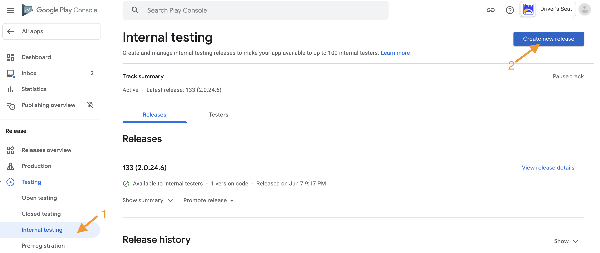
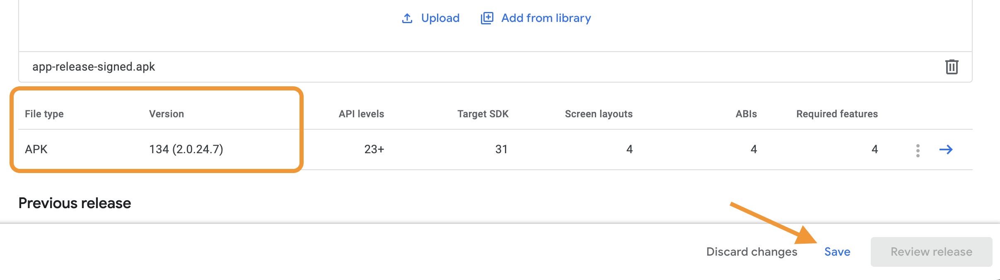
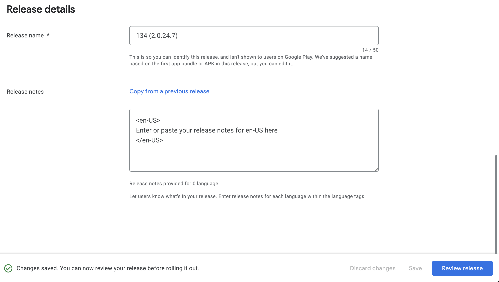
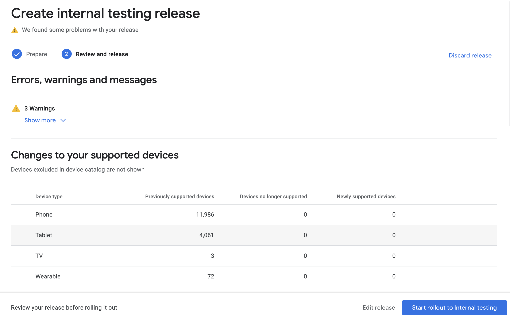

# Android/Google Playstore Deployment Guide

## Prerequisites

* APK 
* ZipAlign
* Access to the Deployment Keystore for signing the APK
  * and its password

## Perform the Web App Build

```shell
ionic cap build android --configuration=prod --release --no-open
```

This will build the angular application applying the `environment.prod.ts` settings and prevent Android Studio from opening.


## Perform the Gradle Build

```shell
ionic cap copy android --configuration=prod && \
(cd android && ./gradlew assembleRelease)
```

## Package the Android APK

Execute the following command replacing `<<YOUR KEYSTORE>>` with the location of the android deploy keystore.
**This keystore should not be placed in your source or committed to github**

```shell
(cd android/app/build/outputs/apk/release && \
zipalign 4 app-release-unsigned.apk app-release-signed.apk && \
apksigner sign \
  --v1-signing-enabled true \
  --v2-signing-enabled true \
  --min-sdk-version 23 \
  --out app-release-signed.apk \
  --in app-release-unsigned.apk \
  --ks <<YOUR KEYSTORE>> )
```

You'll be prompted for your keystore password

## Create Release in Google Play Store

* Navigate to your [Google Play Store Project](https://play.google.com/console) and select your app
  <br/>

* Create a new Internal Testing release
  
  <br/>

* Upload the APK created above
  
  * When it finishes uploading, confirm that the version information matches what you've set.
    * For example, something like `207(4.0.1)`
  * Click "Save"
  <br/>

* Update Release notes
  
  * If available, add the release notes.  If not, this can be done when publishing to production.
  * Click "Review Release"
  <br/>

* Push Release for Internal Testing
  