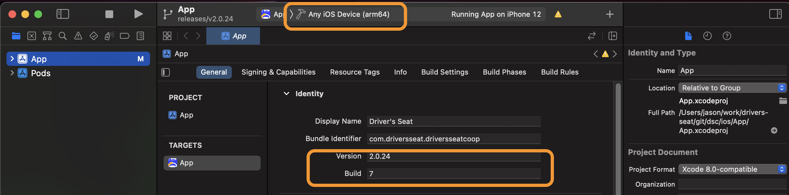
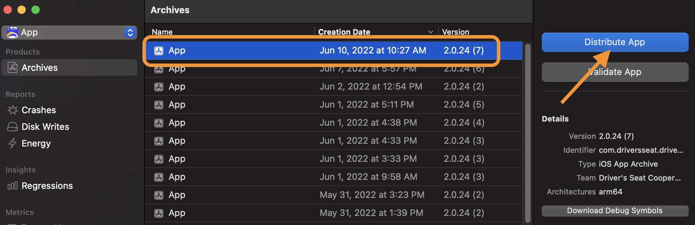
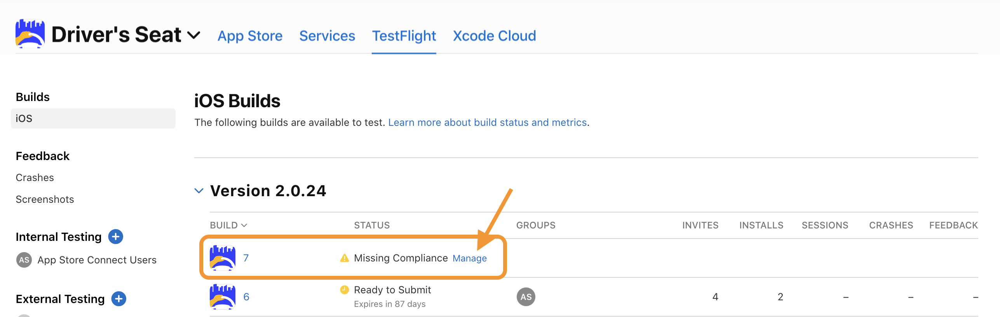
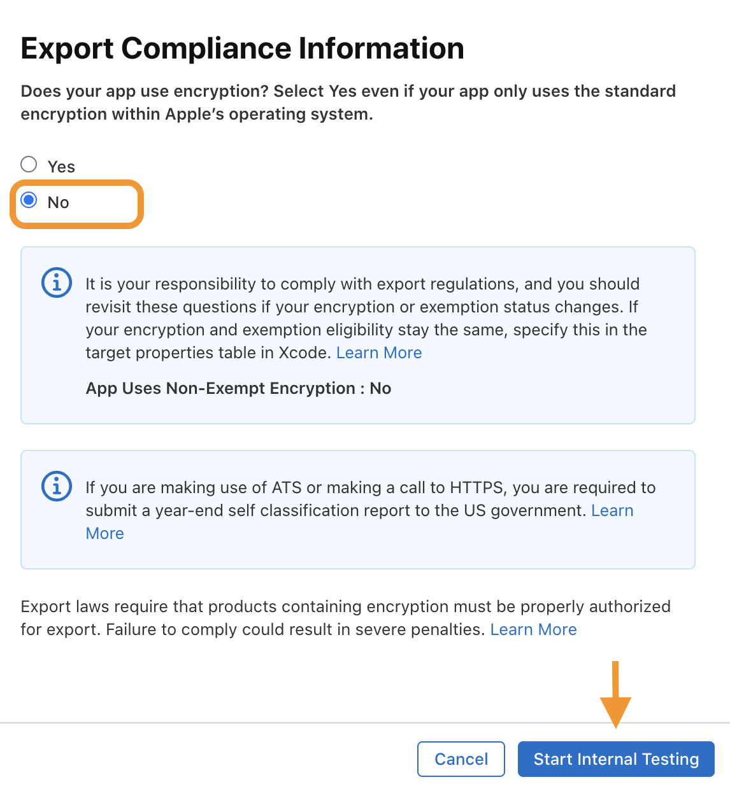

# iOS/Apple Store Deployment Guide

## Perform the Web App Build

```shell
ionic cap build ios --configuration=prod --release
```

This will build the angular applications applying the `environment.prod.ts` settings and open XCode for further work.


## **Verify Xcode Project Settings and Build Native Application**

* Within Xcode, verify the following settings

  * Display Name
  * Bundle Identifier
  * Version
  * Build

  

* From the menu select Product->Archive

## Deploy to AppStore Connect

When the build is complete, a list of archives should appear



* Verify that the top item is the correct version and build number.
* Click "Distribute App"
* Method of Distribution
  * Select "App Store Connect"
  * Click "Next"
* Destination
  * Select "Upload"
  * Click "Next"
* Distribution Options
  * All options should be checked
  * Click "Next"
* Certificate and iOS App Store profiles
  * Distribution Certificate: `_____`
  * App.app: `_____`
  * Click "Next"
* Review App.ipa conent
  * Click "Upload"
  * This will take a while (sometimes 10-15 minutes)


## Test Flight

* Navigate to your https://appstoreconnect.apple.com/apps/__YOUR_APP_ID__/testflight/ios
* Find the newly published build

  
  * It can take 10 minutes to even appear in the list
  * and another 10 minutes to be available to work with
  * Click on "Manage Compliance"

* Confirm Encryption and Start Internal Testing
  

  * This will make the app available to test users and notify them.